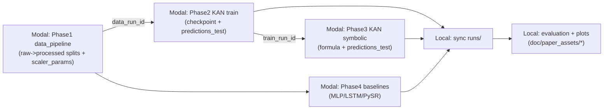

# 项目架构/逻辑/现状说明（交接给“看不到代码”的分析 AI）

> 文档目的：让一个**无法访问本项目代码与文件系统**的 AI，仅凭本 Markdown 文档就能理解：
> 1) 系统做了什么、如何工作（架构与数据流）  
> 2) 当前实验结论与瓶颈（为什么“可解释性”和“性能”很难兼得）  
> 3) 在尽量贴合论文要求的前提下，下一步应如何改进（需要它提出可执行方案）

更新时间：2026-02-26  
项目路径（仅供本地开发者定位）：`/Users/vfch/Documents/project/graduation-design`

---

## 1. 论文要求（以此为最高目标）

论文要求原文（来自项目 README / 用户描述）：

> 在能源领域，准确预测风力和光伏发电的耦合负荷对于电网的稳定运行和智能调度至关重要。与区块链风险检测类似，负荷预测模型也需要高度的可解释性，以便电力工程师理解和信任预测结果。本课题将符号回归应用于风光耦合负荷预测，旨在发现影响负荷变化的潜在物理规律和关键因素（如风速、光照强度、温度、历史负荷等）之间的内在数学关系。通过生成可解释的数学模型，本研究不仅追求预测精度，更致力于揭示能源系统的运行机理，为可再生能源的高效消纳提供理论依据。

**从工程角度拆解为 3 个同时成立的目标：**
1) **预测精度**：至少在合理的预测设置下（不泄漏、不作弊）能达到可用 RMSE / R²  
2) **可解释模型**：输出可读的解析公式（LaTeX/SymPy），并能在测试集上复算指标  
3) **关键因素进入关系式**：公式或分解后的子公式应明确包含（或能证明显著依赖）  
   - 历史负荷（滞后）  
   - 温度 / 光照（GHI）/ 风速（或其代理）  
   - 以及与风光耦合相关的因素（至少在叙事上能自洽：为何风/光会影响“耦合负荷/净负荷”）

> 本项目当前最大的研究难点：在 5min 高频预测任务里，`load_lag_1`（上一时刻负荷）往往**压倒性强**，导致最优公式只依赖历史负荷，外生物理因子（温度/风速/GHI）成为“微小修正项”甚至完全消失。

---

## 2. 系统总体架构（哪里运行、产物怎么流）

### 2.1 运行位置

- **Modal（云端）**：跑耗时的训练/符号提取/基线（PyTorch / Julia(PySR)）  
  - 所有远端产物写入 Modal Volume（持久化存储）
- **本地（Mac）**：同步 run 产物到本地 `runs/`，再做评估、绘图、生成论文资产

### 2.2 存储契约（非常重要）

- 远端 Volume 内固定写入路径：`/vol/runs/<run_id>/...`  
- 本地同步后固定落盘：`runs/<run_id>/...`（该目录默认不提交 Git）

每个 run 目录至少包含：
- `payload.json`：该 run 的元信息（超参、数据版本、时间戳、特征列等）
- `artifacts/`：预测结果、符号公式、评估指标、可解释性报告、图片等
- （训练类）`checkpoint/`：模型权重（可复现/可继续训练）

> 更完整约定见 `.planning/MODAL.md`（本交接文档已把关键点复述在此）。

### 2.3 端到端数据流（文字版）

1) Phase 1 数据管道（Modal）  
   原始 HDF5 → 清洗/插值/质量报告 → 特征工程（含滞后特征）→ 按时间切分 train/val/test → Z-score（只拟合 train）  
   输出：`runs/<data_run_id>/processed/{train,val,test}_<timestamp>.parquet` + `scaler_params.json`

2) Phase 2 训练（Modal）  
   读取 processed splits → 选取特征列 → 训练 KAN（含稀疏正则）→ 剪枝→（可选）精修  
   输出：`runs/<train_run_id>/checkpoint/model.pt` + `artifacts/predictions_test.parquet` + 稀疏度/特征重要性等

3) Phase 3 符号提取（Modal）  
   读取 KAN checkpoint → per-edge symbolic matching → 拼接成整体 SymPy 表达式 → 输出 LaTeX/SymPy/复杂度/测试集指标  
   输出：`runs/<sym_run_id>/artifacts/formula.sympy.txt`、`formula.tex`、`formula_eval_test.json`、`predictions_test.parquet`

4) Phase 4 基线（Modal）  
   - Torch：MLP/LSTM  
   - PySR：符号回归（Julia）

5) Phase 5–8 本地评估与论文资产（Local）  
   读取多个 `runs/<id>` → 生成对比表、Pareto 图、消融图、transfer gap、敏感性分析、物理映射报告、论文图像索引

### 2.4 端到端数据流（Mermaid）

---

## 3. 代码组织（让看不到代码的 AI 也能理解模块职责）

### 3.1 顶层目录

- `modal_jobs/`：所有 Modal 任务入口（数据/训练/符号提取/基线）  
- `src/`：核心算法与工具库（数据处理、KAN 训练工具、符号构建、评估等）  
- `scripts/`：本地脚本（同步、评估、绘图、解释性报告、实验驱动）  
- `runs/`：同步的实验产物（不提交 Git）  
- `doc/paper_assets/`：可直接用于论文写作的表格与图片（可提交 Git，视学校/开源要求）  
- `doc/optimization/`：post-v1 优化会话日志/manifest（本地生成）  
- `tests/`：单元测试（TDD 保障改动不破坏闭环）  
- `.planning/`：路线图、Modal 契约、阶段验证记录

---

## 4. 数据管道（Phase 1）——“耦合负荷”数据如何构造

### 4.1 数据来源与时间分辨率

- 数据源：ARPA-E PERFORM（风、光、负荷实际值）  
- 时间分辨率：5 分钟（全年约 105,120 条）

### 4.2 清洗与缺失处理

- 短缺失：三次样条插值（cubic spline）  
- 产出质量报告：缺失率、插值点数量、异常值（3-sigma 标记但不改值）等

### 4.3 特征工程（核心）

系统刻意把特征分为多组，便于可解释性分析与控制：

1) **气象代理（Open-Meteo 历史档案，hourly → 5min 重采样插值）**  
   - `temp_2m_c`（温度）  
   - `ghi_w_m2`（全局水平辐照度 GHI，光照强度 proxy）  
   - `wind_speed_10m_m_s`（10m 风速）  
   - `surface_pressure_hpa`（气压）

2) **天文太阳位置（pvlib）**  
   - `solar_altitude`、`solar_azimuth`、`is_night`

3) **周期编码（sin/cos）**  
   - `hour_sin/cos`、`dow_sin/cos`、`month_sin/cos`

4) **自回归滞后特征（t-1..t-48）**  
   - 为 `load/wind/solar` 都生成 `*_lag_k`（k=1..48，5min 步长 → 覆盖 4 小时）

> 研究意义：滞后项表达“系统惯性/记忆效应”；气象/太阳位置表达“外生物理驱动”；周期编码表达“人类活动周期”。

### 4.4 切分与防泄漏

- 按时间顺序切分 train/val/test  
- 在 train/val 与 val/test 之间插入 48-step gap（防止滞后特征跨边界泄漏）  
- 切分后，每个 split 再丢弃最前 48 行（去掉 lag 造成的 NaN）

### 4.5 归一化

- 对所有数值特征做 Z-score，但**不归一化 target**（例如 load）  
- 仅在 train 上拟合 scaler，并保存参数到 `scaler_params.json`

### 4.6 一个已验证的数据 run（可复现实验基准）

数据管道 run（ERCOT 2018, target=load）：`2026-02-26_032058_1957fda1`
- 原始行数：105,120  
- 特征后列数：160  
- 切分后：train/val/test = 73,536 / 15,672 / 15,672  
（这些信息写在该 run 的 `payload.json` 内）

---

## 5. 模型与训练（Phase 2）——KAN 稀疏训练 + 剪枝

### 5.1 KAN 训练的核心理念

KAN（Kolmogorov–Arnold Network）把每条边看作一元函数（样条 B-spline），天然更利于符号化与解释。

本项目训练目标不是单纯最小化误差，而是：
- 在误差可接受的情况下，让网络变得**极稀疏**（大部分边剪掉）
- 让剩余边更容易被符号库拟合成解析函数

### 5.2 训练流程（分阶段）

典型训练包含 3 段（每段都会周期性写 checkpoint 并 commit 到 Volume）：
1) warmup：主要拟合、更新 grid  
2) sparsify：加入复合正则（幅度/L1/熵等）逼迫边权归零  
3) refine：剪枝后用 LBFGS 精修（可选）

随后进行剪枝候选搜索（不同 node/edge 阈值），挑选：
- 稀疏度 ≥ target_pruned_ratio（默认 0.8）
- pruned 后 RMSE 不超过 unpruned 的一定比例（默认 1.1 倍）

### 5.3 Phase 2 输出

典型输出文件：
- `checkpoint/model.pt`：包含模型 state + payload + feature_cols + target_scaler + 最佳剪枝阈值
- `artifacts/predictions_test.parquet`：对 test split 的预测（用于统一评估口径）
- `artifacts/feature_importance.csv`：从稀疏结构统计“哪些特征仍有活跃边”
- `artifacts/sparsity.json`：剪枝比例（复杂度 proxy）
- `artifacts/eval_unpruned.json`、`artifacts/eval_pruned.json`：训练期监控指标（注意：基于 val split）

### 5.4 频繁调参点（已暴露为 CLI）

为方便实验迭代，本项目已将“经常改的部分”暴露到 `kan_train` 的 CLI：
- 训练超参：steps / lambdas / hidden_width / hidden_mult / mult_arity / use_gpu / max_train_rows
- 特征选择：`include_groups`、`lag_series`、`lag_steps`、`include_base`

关键点：可以用 `lag_series=none` 或移除 `load` 来抑制“历史负荷滞后项压制一切”的问题。

---

## 6. 符号提取（Phase 3）——从稀疏 KAN 变成可读公式

### 6.1 方法概述

- 对每条未剪掉的边，调用 `suggest_symbolic()` 在一个符号库中寻找最拟合的一元函数  
- 依据 `r2_threshold` 决定是否“固定”该边为符号函数  
- 把所有边组合成最终的 SymPy 表达式，并用 scaler 参数做**输入/输出反归一化**，使公式直接对应原始量纲

### 6.2 符号库（可控）

默认库大致包括：
- 多项式：`x, x^2, x^3, x^4`
- 三角：`sin, cos`
- 非线性：`exp, gaussian, abs`

已支持在 CLI 里用 `--lib` 传入逗号分隔列表，从而禁止 `exp/gaussian` 以提升可解释性（代价是拟合能力下降）。

### 6.3 Phase 3 输出

典型输出文件：
- `artifacts/formula.sympy.txt`：一行 SymPy 表达式（可复算）
- `artifacts/formula.tex`：LaTeX（论文可直接贴）
- `artifacts/formula_metrics.json`：复杂度（node_count / tree_depth 等）
- `artifacts/formula_eval_test.json`：公式在 test 上的 RMSE/MAE/R²
- `artifacts/predictions_test.parquet`：公式预测结果

---

## 7. 基线（Phase 4）——用于论证“不是只有 KAN 才能做到”

已实现并验证的基线：
- Torch：`MLP`、`LSTM`
- PySR：直接符号回归（Julia），支持 seeded（用 KAN symbolic 提供候选特征/形式）

重要事实（对论文叙事很关键）：
- 在 **5 分钟预测**任务里，只要允许 `load_lag_1`，简单模型就能做到接近“复制上一时刻”，RMSE 会非常低。  
  这会导致：性能对比上 PySR/MLP 很强，但公式也会非常“自回归化”，物理外生因子难出头。

---

## 8. 评估、可解释性报告与论文资产（Phase 5–8，本地）

本地脚本会生成一套“可直接写进论文”的资产（目录 `doc/paper_assets/`），核心包括：
- `comparison_table.csv`：多 run 指标对比（rmse/mae/r2/complexity/physical_score/compute_time 等）
- `pareto_rmse_vs_complexity.png`：精度-复杂度散点
- `ablation_table.csv` + ablation 图：正则项消融
- `transfer_gaps.csv`：跨 ISO 迁移差距（若跑过 transfer_eval）
- `physics_mapping_*.md/json`：物理映射报告（目前对 load 仅做“温度敏感性存在”检查）
- `sensitivity_*`：敏感性分析（对温度/风速/GHI 等变量的导数分布与散点）
- `figures/`：预测曲线、残差分布、公式渲染图等
- `ASSET_INDEX.md`：把所有资产索引成可快速引用的清单

> 注意：`physics_mapping.json` 是本地脚本写入的，会被 `sync_from_modal.sh` 重新同步覆盖；因此每次重新 sync 之后，若需要 `physical_score` 进入对比表，需要重新跑 physics_mapping 脚本。

---

## 9. 一键实验驱动（重要：方便后续 AI 给“可执行调参方案”）

为便于频繁调参，本项目把“调参 + Modal 调用 + 同步 + 本地评估/绘图/索引”集成到单文件脚本：

- `scripts/experiment_driver.py`

使用方式：
1) 编辑脚本顶部 `CONFIG`（数据 run_id、KAN sweep、symbolic sweep、是否跑 baselines 等）
2) 先 dry-run 看命令：
   - `python3 scripts/experiment_driver.py --dry-run`
3) 真跑：
   - `python3 scripts/experiment_driver.py --execute`

每次运行会写入：
- `doc/optimization/<session_id>/manifest.json`：run_id 列表 + 超参 + 指标快照
- `doc/optimization/<session_id>/run_log.md`：可读日志

---

## 10. 同步脚本（`sync_from_modal.sh`）近期变更说明

原因：Modal CLI 在下载目录时，可能出现“嵌套路径”差异，导致本地出现：
- `runs/<id>/<id>/payload.json`（重复嵌套）
- 或下载到 `runs/` 根目录导致结构混乱

当前脚本采取更稳健策略：
1) 先下载到临时目录  
2) 通过定位 `payload.json` 判断真实 run 根目录  
3) 再把内容复制到 `runs/<run_id>/`  

这保证：只要远端遵守 `/vol/runs/<run_id>/...` 契约，本地同步结构就稳定一致。

---

## 11. 已验证的关键 run（现状与“遇到的情况”）

> 下面列出关键结论：**性能很强的模型通常被历史负荷滞后项主导**；  
> 强行去掉滞后项能让温度/太阳角度进入公式，但性能大幅下降。

### 11.1 数据 run

- Phase 1（ERCOT 2018, target=load）：`2026-02-26_032058_1957fda1`
  - 105,120 行；特征后 160 列；切分后 73,536 / 15,672 / 15,672

### 11.2 预测性能（test）概览（部分关键 run）

（说明：均为 test split 指标；若是 symbolic run，则为公式在 test 上的指标）

| run_id | 类型 | target | 关键设置 | RMSE | R² | 备注 |
|---|---|---|---|---:|---:|---|
| `2026-02-26_043102_777fac2d` | Torch MLP | load | 含 `load_lag_1` | ~175.7 | ~0.9986 | 5min 预测几乎可复制上一时刻 |
| `2026-02-26_045336_77244377` | PySR | load | 含 `load_lag_1` | ~127.6 | ~0.9992 | 公式非常简单但强依赖历史负荷 |
| `2026-02-26_055200_958b3949` | KAN train | load | 消融 no_l1（仍含 lag） | ~1050.1 | ~0.9484 | KAN 明显落后于简单基线 |
| `2026-02-26_090620_1fc7d27a` | KAN symbolic | load | 从 `055200` 提取 | ~1861.0 | ~0.8380 | 性能下降；公式仍主要由 load lag 组成 |
| `2026-02-26_122629_b5a495b4` | KAN train | load | **去掉所有 lag**（外生-only） | ~5555.4 | ~-0.4431 | 性能崩溃，但利于“物理因子进公式” |
| `2026-02-26_130651_18ca3f58` | KAN symbolic | load | 外生-only + 禁 exp/gaussian | ~5641.6 | ~-0.4883 | 公式含 `temp_2m_c`/`solar_altitude`，物理映射得分 1 |

> 物理映射报告（本地生成，供论文引用）：`doc/paper_assets/physics_mapping_<run_id>.md/json`

### 11.3 当前“遇到的情况”（问题陈述）

1) **强自回归支配**：允许 `load_lag_1` 时，所有强模型（MLP/PySR/部分 KAN）都会主要依赖它 → 精度极高，但“风速/光照/温度”很难进入最终公式（或只作为很小的修正项，容易被剪枝/符号化忽略）。  
2) **外生-only 可解释但不准**：去掉所有 lag 后，温度/太阳高度角等会进入公式，甚至能通过“温度敏感性存在”的检查，但预测性能显著下降（R² 变负）。  
3) **KAN vs 简单基线差距**：在当前设置下，KAN 的最佳 run 仍明显弱于 PySR/MLP；需要判断是训练超参/稀疏策略过强、还是任务定义让基线天然占优。  
4) **耦合负荷定义需明确**：论文提“风光耦合负荷”，但目前实验目标主要是 `load`；如果“耦合负荷”更接近净负荷 `net_load = load - wind - solar` 或某种耦合形式，则需要在数据定义/目标函数上做调整，才能让风/光因子在数学关系中自然出现。  

---

## 12. 交给分析 AI 的“任务说明”（让它给下一步方案）

请基于上述架构与现状，输出一个**可执行的改进方案**，要求：

1) **贴合论文要求**：解释清楚如何让关键因素（风速/光照/温度/历史负荷）进入可解释数学关系中，并能在 test 上验证  
2) **兼顾性能**：不能只为了可解释而让 R² 长期为负；需要给出“性能与可解释性的折中策略”  
3) **可落地**：最好以 `scripts/experiment_driver.py` 的可调配置为核心，给出 2–4 组建议 sweep（包括特征选择与训练/符号提取参数）  
4) **避免“显而易见的作弊/平凡解”**：例如把 `net_load = load - wind - solar` 直接当作“发现的规律”应明确其学术意义有限；若使用，也应说明它在论文中的定位（定义 vs 发现）。  
5) **建议补充的评估**：例如改变预测 horizon（1h ahead）、做残差建模、分解模型（baseline + correction）、或扩展物理映射检查（不仅温度，还应检查 GHI/风速敏感性）等。

可选但加分：
- 给出“论文叙事结构”的建议：如何把“高精度基线”和“KAN-SR 物理发现”组合成一篇可信的毕业论文。

---

## 13. 本地复现（给开发者，不给外部 AI）

单测：
- `python3 -m unittest discover -s tests -p 'test_*.py'`

一键实验：
- `python3 scripts/experiment_driver.py --dry-run`
- `python3 scripts/experiment_driver.py --execute`

论文资产重生成：
- 参考 `doc/paper_assets/README.md`

